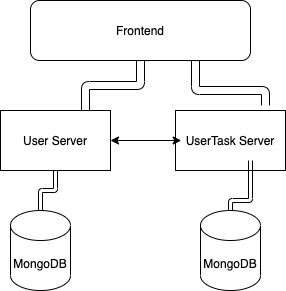

#### Start the node servers

Run `docker-compose build` to build the images of the two servers: users and userTasks

Run `docker-compose up -d` to create and start the servers

#### Start the React App

Run `cd packages/client` to go to the client's folder
Run `npm install` to install the packages
Run `npm start` to start the frontend app

#### Hosting

The servers are hosted seperately using free Heroku dynos

Users server `https://api-rex-user-tasks.herokuapp.com/`

UserTasks server `https://api-rex-user-tasks.herokuapp.com/`

Frontend was hosted on Netlify `https://nifty-dubinsky-aa0db4.netlify.app/`

#### Architecture Design

